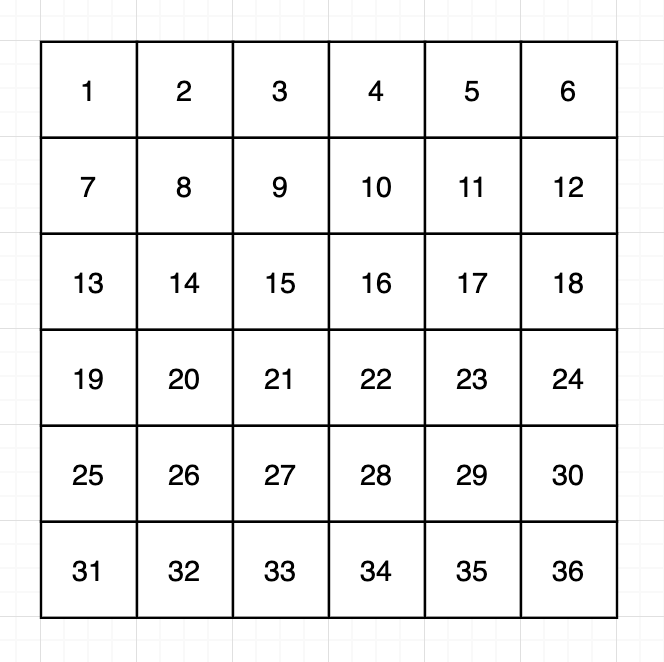
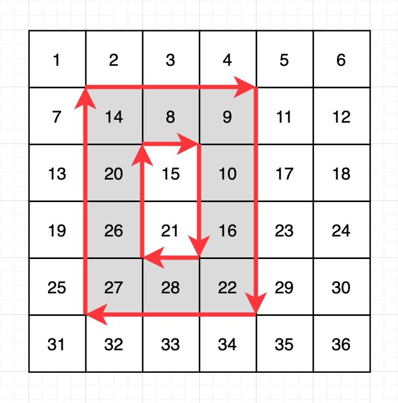
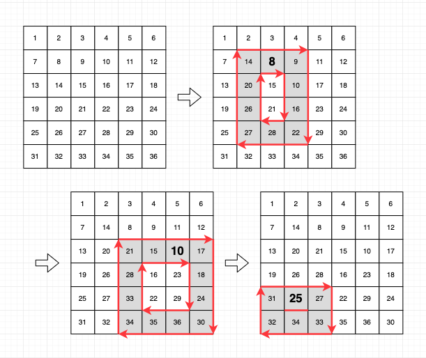
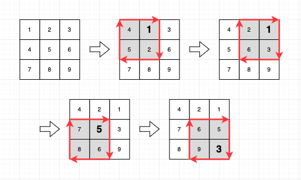

Ta có một ma trận kích thước hàng x cột. Ma trận chứa các số từ 1 đến hàng x cột, được viết theo thứ tự từng hàng. Ta muốn xoay các số trên biên của ma trận theo chiều kim đồng hồ bằng cách chọn nhiều vùng hình chữ nhật. Mỗi lần xoay được biểu diễn bằng bốn số nguyên (x1, y1, x2, y2), và ý nghĩa của chúng như sau:

Xoay các số trên biên của hình chữ nhật tương ứng với vùng từ hàng x1, cột y1 đến hàng x2, cột y2 một bước theo chiều kim đồng hồ.

Dưới đây là một ví dụ về ma trận 6 x 6.

Nếu bạn áp dụng phép quay (2, 2, 5, 4) cho ma trận này, đường viền của vùng từ hàng 2, cột 2 đến hàng 5, cột 4 sẽ quay theo chiều kim đồng hồ, như hình dưới đây. Lưu ý rằng vùng trung tâm chứa 15 và 21 không bị quay.

Cho ma trận có chiều dài theo chiều dọc (số hàng) `rows`, chiều dài theo chiều ngang (số cột) `columns` và một danh sách các phép quay `queries`, hãy hoàn thành hàm `solution` để áp dụng từng phép quay vào mảng, lưu trữ các số nhỏ nhất có vị trí bị thay đổi bởi phép quay đó theo thứ tự và trả về kết quả.

Ràng buộc

`rows` là một số tự nhiên nằm giữa 2 và 100 (bao gồm cả 2 và 100).

`columns` là một số tự nhiên nằm giữa 2 và 100 (bao gồm cả 2 và 100).

Ban đầu, ma trận chứa các số được viết theo chiều ngang bắt đầu từ 1 và tăng dần từng đơn vị.

Tức là, khi không áp dụng phép quay nào, số ở hàng i và cột j là ((i-1) x columns + j).

Số hàng (số phép quay) trong `queries` nằm giữa 1 và 10.000 (bao gồm cả 1 và 10.000).

Mỗi hàng của `queries` bao gồm bốn số nguyên [x1, y1, x2, y2].

Điều này có nghĩa là xoay đường viền của vùng từ hàng x1, cột y1 sang hàng x2, cột y2 theo chiều kim đồng hồ. 1 ≤ x1 < x2 ≤ hàng, 1 ≤ y1 < y2 ≤ cột.

Tất cả các phép xoay được thực hiện theo thứ tự.

Ví dụ, câu trả lời cho phép xoay thứ hai là tìm giá trị nhỏ nhất trong số các số được di chuyển khi phép xoay thứ hai được thực hiện sau khi phép xoay đầu tiên đã được thực hiện.

Ví dụ về Nhập/Xuất

| rows | columns | queries | result |
|------|---------|---------|--------|
| 6 | 6 | `[[2,2,5,4],[3,3,6,6],[5,1,6,3]]` | `[8, 10, 25]` |
| 3 | 3 | `[[1,1,2,2],[1,2,2,3],[2,1,3,2],[2,2,3,3]]` | `[1, 1, 5, 3]` |
| 100 | 97 | `[[1,1,100,97]]` | `[1]` |

Giải thích Ví dụ về Nhập/Xuất

Ví dụ Nhập/Xuất #1

Quá trình thực hiện phép quay có thể được minh họa như sau:

Ví dụ về nhập/xuất #2

Quá trình thực hiện phép quay được minh họa như sau.

Ví dụ về nhập/xuất #3

Trong ví dụ này, tất cả các ô nằm trên các cạnh của ma trận đều di chuyển. Do đó, đáp án là 1, là số nhỏ nhất trong số các số nằm trên các cạnh của ma trận.