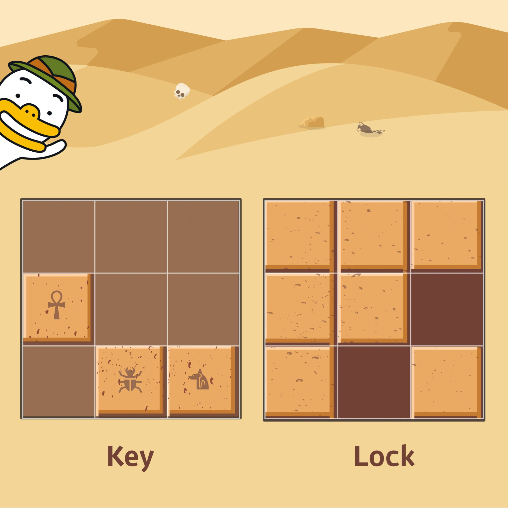

Nhà khảo cổ học "Tube" đã phát hiện ra một cánh cửa bí mật tại một di tích cổ, được cho là chứa đầy kho báu và di vật. Tuy nhiên, khi kiểm tra cánh cửa để mở nó, ông thấy nó bị khóa bằng một loại khóa độc đáo. Trước cửa, ông tìm thấy một mảnh giấy hướng dẫn cách mở khóa, cùng với một chiếc chìa khóa có hình dạng đặc biệt.

Ổ khóa có dạng lưới vuông N x N, trong đó mỗi ô là 1 x 1, và chiếc chìa khóa có hình dạng đặc biệt là lưới vuông M x M.

Ổ khóa có các rãnh được khắc trên đó, và chìa khóa cũng có các rãnh và phần nhô ra. Chìa khóa có thể xoay và di chuyển, và ổ khóa sẽ mở khi các phần nhô ra của chìa khóa khớp hoàn hảo vào các rãnh của ổ khóa. Các rãnh và phần nhô ra của chìa khóa nằm ngoài khu vực khóa không ảnh hưởng đến quá trình mở khóa; tuy nhiên, bên trong khu vực khóa, các phần nhô ra của chìa khóa và các rãnh của ổ khóa phải thẳng hàng chính xác, và các phần nhô ra của chìa khóa và ổ khóa không được chạm vào nhau. Ngoài ra, ổ khóa chỉ có thể mở được nếu tất cả các rãnh đều được lấp đầy, không để lại khoảng trống nào.

Cho một mảng 2D `key` đại diện cho chìa khóa và một mảng 2D `lock` đại diện cho ổ khóa làm tham số, hãy hoàn thành hàm `solution` để trả về `true` nếu ổ khóa có thể mở được bằng chìa khóa, và `false` nếu ngược lại.

Ràng buộc

`key` là một mảng 2D có kích thước M x M (3 ≤ M ≤ 20, trong đó M là số tự nhiên).

`lock` là một mảng 2D có kích thước N x N (3 ≤ N ≤ 20, trong đó N là số tự nhiên).

M luôn nhỏ hơn hoặc bằng N.

Các phần tử của `key` và `lock` bao gồm các số 0 hoặc 1.

0 đại diện cho rãnh, và 1 đại diện cho phần nhô ra. Ví dụ về đầu vào/đầu ra

Kết quả khóa

[[0, 0, 0], [1, 0, 0], [0, 1, 1]] [[1, 1, 1], [1, 1, 0], [1, 0, 1]] đúng

Giải thích ví dụ về đầu vào/đầu ra

Nếu bạn xoay chìa khóa 90 độ theo chiều kim đồng hồ, di chuyển nó sang phải một nấc và xuống dưới một nấc, bạn có thể lấp đầy toàn bộ rãnh của ổ khóa một cách chính xác.