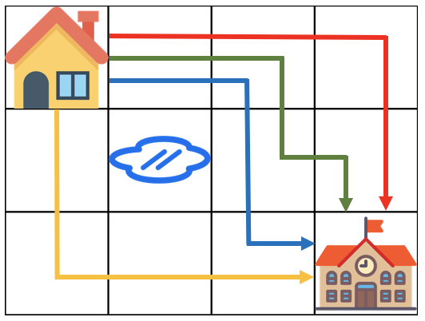

Do mưa lớn kéo dài, một số khu vực đã bị ngập lụt. Chúng tôi dự định đi học qua khu vực không bị ngập. Đường đi từ nhà đến trường có thể được biểu diễn dưới dạng lưới m x n.

Hình dưới đây minh họa trường hợp m = 4 và n = 3.

Tọa độ của góc trên bên trái, nơi nhà ở, được biểu diễn là (1, 1), và tọa độ của góc dưới bên phải, nơi trường học, được biểu diễn là (m, n).

Kích thước lưới m và n, và một mảng 2D `puddles` chứa tọa độ của các khu vực bị ngập lụt được cho trước làm tham số. Hãy viết một hàm `solution` trả về phần dư của phép chia số đường đi ngắn nhất từ ​​nhà đến trường cho 1.000.000.007, chỉ di chuyển sang phải và xuống dưới.

Ràng buộc

Kích thước lưới m và n là các số tự nhiên nằm giữa 1 và 100 (bao gồm cả 1 và 100).

Trường hợp cả m và n đều bằng 1 sẽ không được đưa vào làm dữ liệu đầu vào. Số lượng khu vực bị ngập lụt nằm trong khoảng từ 0 đến 10, bao gồm cả 0 và 10.

Nhà cửa và trường học không được bao gồm trong dữ liệu đầu vào.

Ví dụ đầu vào/đầu ra

m=4, n=2 
vũng nước = [[2, 2]]
return = 4

Giải thích 

