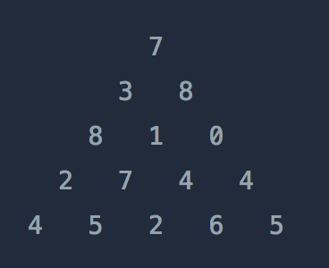

Chúng ta đang cố gắng tìm đường đi từ đỉnh xuống đáy của tam giác được hiển thị ở trên sao cho tổng các số đi qua lớn nhất. Khi di chuyển xuống, bạn chỉ có thể di chuyển một bước chéo sang phải hoặc trái. Ví dụ, từ số 3, bạn chỉ có thể di chuyển đến số 8 hoặc số 1 ở ô bên dưới.

Cho một mảng `triangle` chứa thông tin của tam giác làm tham số, hãy hoàn thành hàm `solution` để trả về tổng lớn nhất của các số đã đi qua.

Ràng buộc

Chiều cao của tam giác nằm trong khoảng từ 1 đến 500.

Các số tạo thành tam giác là các số nguyên từ 0 đến 9999.

Ví dụ đầu vào/đầu ra

