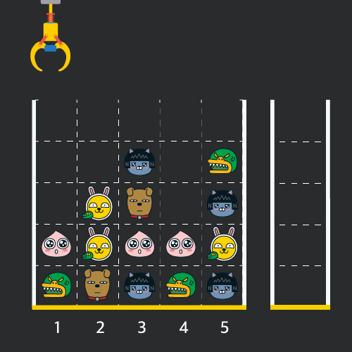
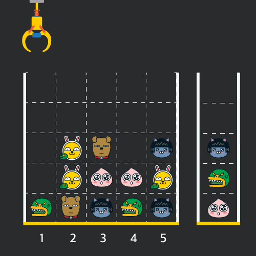
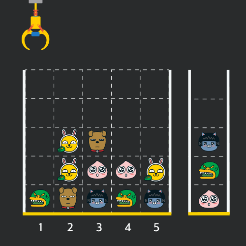
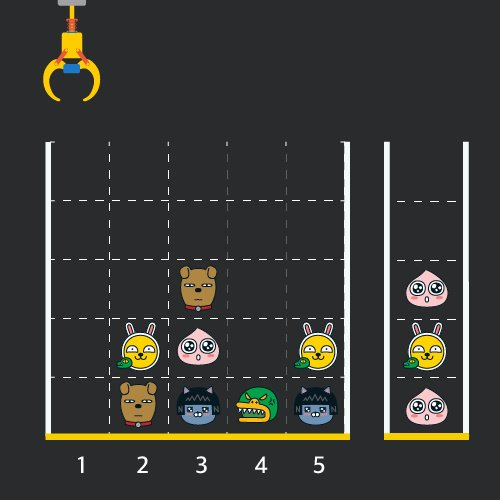

# Trò chơi máy gắp thú nhồi bông
#### Nhà phát triển game "Jordy" dự định tạo ra một trò chơi di động dựa trên máy gắp thú nhồi bông.
#### Để tăng thêm sự thú vị cho trò chơi, "Jordy" dự định tích hợp các bố cục màn hình và luật chơi sau vào logic trò chơi.

#### Màn hình trò chơi là một lưới vuông "N x N" được tạo thành từ các ô "1 x 1", với một cần cẩu ở phía trên và một giỏ ở bên phải. (Hình ảnh phía trên là ví dụ "5 x 5"). Mỗi ô lưới chứa nhiều búp bê khác nhau, và các ô không có búp bê thì trống. Tất cả các búp bê chiếm một ô lưới "1 x 1" duy nhất và được xếp chồng lên nhau theo thứ tự bắt đầu từ ô dưới cùng. Người chơi có thể di chuyển cần cẩu sang trái hoặc phải để nhặt búp bê ở vị trí dừng trên cùng của lưới. Các búp bê được nhặt lên sẽ được đặt vào giỏ, xếp chồng theo thứ tự bắt đầu từ ô dưới cùng. Hình ảnh sau đây cho thấy các búp bê được nhặt lên theo thứ tự từ các vị trí [1, 5, 3] và đặt vào giỏ.

#### Nếu hai con búp bê cùng hình dạng được xếp chồng liên tiếp trong giỏ, hai con búp bê sẽ bật ra và biến mất khỏi giỏ. Nếu bạn nhặt một con búp bê từ vị trí [5] và xếp nó vào giỏ từ trạng thái trên, hai con búp bê cùng hình dạng sẽ biến mất.

#### Không có trường hợp nào mà búp bê không được nhặt lên khi cần cẩu được vận hành; tuy nhiên, nếu cần cẩu được vận hành ở vị trí không có búp bê, thì không có gì xảy ra. Ngoài ra, giả sử giỏ đủ lớn để chứa tất cả các búp bê. (Trong hình, chỉ hiển thị 5 ô do hạn chế hiển thị trên màn hình.)
#### Cho một mảng 2D `board` chứa trạng thái của lưới màn hình trò chơi và một mảng `moves` chứa các vị trí mà cần cẩu đã được vận hành để nhặt búp bê làm tham số, hãy hoàn thành hàm `solution` để trả về số lượng búp bê đã được nhặt lên và biến mất sau khi tất cả các cần cẩu đã được vận hành.

## [Ràng buộc]
#### Mảng `board` là một mảng 2D có kích thước từ "5 x 5" đến "30 x 30" (bao gồm cả 0 và 30).
#### Mỗi ô trong `board` chứa một số nguyên từ 0 đến 100 (bao gồm cả 0 và 100).
#### 0 biểu thị một ô trống.
#### Mỗi số từ 1 đến 100 đại diện cho một hình dạng búp bê khác nhau, và cùng một số đại diện cho các búp bê có cùng hình dạng.
#### Kích thước của mảng `moves` nằm trong khoảng từ 1 đến 1000 (bao gồm cả 1 và 1000). Giá trị của mỗi phần tử trong mảng `moves` là một số tự nhiên lớn hơn hoặc bằng 1 và nhỏ hơn hoặc bằng chiều rộng của mảng `board`.

## Ví dụ đầu vào/đầu ra

|board|moves|result|
|---|---|---|
|[[0,0,0,0,0],[0,0,1,0,3],[0,2,5,0,1],[4,2,4,4,2],[3,5,1,3,1]]|[1,5,3,5,1,2,1,4]| 4 |

#### Giải thích các ví dụ đầu vào/đầu ra
#### Trạng thái ban đầu của các con búp bê giống như ví dụ đã cho trong bài toán. Sau khi cần cẩu nhặt các con búp bê theo thứ tự từ các vị trí [1, 5, 3, 5, 1, 2, 1, 4] và đặt chúng vào giỏ, trạng thái được hiển thị trong hình bên dưới, và 4 con búp bê đã bị bật ra và biến mất trong quá trình đặt chúng vào giỏ.
