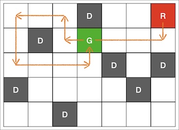

Có một trò chơi trên bàn cờ tên là Robot Ricochet.
Trò chơi này bao gồm việc di chuyển một quân cờ trên một bàn cờ hình lưới. Mục tiêu là xác định số bước di chuyển tối thiểu cần thiết để dừng chính xác tại vị trí mục tiêu sau khi bắt đầu từ vị trí ban đầu.
Trong trò chơi này, một bước di chuyển được định nghĩa là trượt từ vị trí hiện tại theo một trong các hướng sau (lên, xuống, trái hoặc phải) cho đến khi quân cờ chạm vào chướng ngại vật hoặc cạnh của bàn cờ.
Sau đây là một ví dụ về bàn cờ. ("." biểu thị một ô trống, "R" biểu thị vị trí ban đầu của robot, "D" biểu thị vị trí của một chướng ngại vật và "G" biểu thị điểm mục tiêu.)

```bash
...D..R
.D.G...
....D.D
D....D.
..D....
```

Trong trường hợp này, số bước di chuyển tối thiểu là 7. Nếu bạn di chuyển từ vị trí "R" theo thứ tự Xuống, Trái, Lên, Trái, Xuống, Phải và Lên, bạn có thể dừng lại ở vị trí "G".



Cho một mảng chuỗi `board` biểu thị trạng thái của bàn cờ, hãy hoàn thành hàm `solution` để trả về số bước di chuyển tối thiểu cần thiết để một quân cờ đến được vị trí mục tiêu. Nếu không thể đến được vị trí mục tiêu, hãy trả về -1.

Ràng buộc
- 3 ≤ độ dài của board ≤ 100
- 3 ≤ độ dài của các phần tử trong board ≤ 100
- Tất cả các phần tử trong board có cùng độ dài.
- Chuỗi chỉ bao gồm ".", "D", "R" và "G", lần lượt biểu thị một ô trống, một chướng ngại vật, vị trí bắt đầu của robot và điểm mục tiêu.

"R" và "G" chỉ xuất hiện một lần. Ví dụ về Nhập/Xuất

|board |result|
|---|---|
|["...D..R", ".D.G...", "...D.D", "D...D.", "...D..."] | 7|
|[".D.R", "......", "...G...", "...D"] |-1|


Ví dụ Nhập/Xuất #1
Giống như ví dụ trong phần mô tả bài toán.

Ví dụ Nhập/Xuất #2
```bash
.D.R
....
.G..
...D
```
Dù bạn di chuyển quân cờ ở vị trí "R" như thế nào, nó cũng không thể đến được "G".
Vì vậy, trả về -1.
