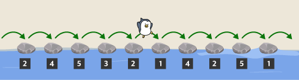
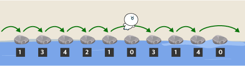
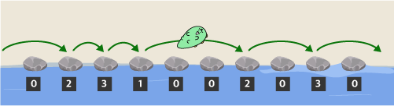
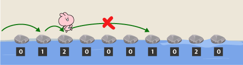

Vượt Qua Những Hòn Đá Bước

Chi Tiết Bài Tập

Mô tả

[Bài toán này có điểm số riêng cho phần kiểm tra độ chính xác và hiệu quả.]

Nhóm "Những Người Bạn Niniz" của trường tiểu học Kakao đang đi dã ngoại mùa thu cùng thầy giáo "Ryan" thì gặp một con suối có những hòn đá bước và quyết định băng qua bờ bên kia. Thầy giáo "Ryan" đã đặt ra các quy tắc sau để đảm bảo nhóm "Những Người Bạn Niniz" có thể băng qua những hòn đá bước một cách an toàn.

Những hòn đá bước được xếp thành một hàng, và mỗi hòn đá bước đều có một số được viết trên đó. Số trên một hòn đá bước giảm đi 1 mỗi khi người chơi bước lên.

Khi số trên một hòn đá bước đạt đến 0, người chơi không thể bước lên nữa; lúc này, người chơi có thể nhảy nhiều ô cùng một lúc đến hòn đá bước tiếp theo.

Tuy nhiên, nếu có nhiều hòn đá bước khả dụng cho hòn đá bước tiếp theo, người chơi phải luôn nhảy đến hòn đá bước gần nhất. Nhóm "Những Người Bạn Niniz" đang ở bên trái của con suối, và họ chỉ được coi là đã băng qua những hòn đá bước khi đến được bên phải của con suối.

Những người bạn Niniz phải lần lượt vượt qua các bậc đá, và người bạn tiếp theo chỉ được phép vượt qua sau khi người bạn trước đó đã vượt qua tất cả các bậc đá.

Cho một mảng `stones` chứa các số được viết trên các bậc đá theo thứ tự và một tham số `k` biểu thị số lượng bậc đá tối đa có thể bỏ qua cùng một lúc, hãy hoàn thành hàm `solution` để trả về số lượng người tối đa có thể vượt qua các bậc đá.

[Ràng buộc]

Số lượng người bạn Niniz cần vượt qua các bậc đá được giả định là không giới hạn.

Kích thước của mảng `stones` nằm trong khoảng từ 1 đến 200.000 (bao gồm cả 1 và 200.000).

Giá trị của mỗi phần tử trong mảng `stones` là một số tự nhiên nằm trong khoảng từ 1 đến 200.000.000 (bao gồm cả 1 và 200.000).

`k` là một số tự nhiên nằm trong khoảng từ 1 đến độ dài của mảng `stones`. [Ví dụ Nhập/Xuất]

stones k result

[2, 4, 5, 3, 2, 1, 4, 2, 5, 1] ​​​​3 3

Giải thích Ví dụ Nhập/Xuất

Ví dụ Nhập/Xuất #1

Người bạn thứ nhất có thể vượt qua các bậc đá như sau.

Sau khi người bạn thứ nhất vượt qua các bậc đá, các số được viết trên các bậc đá được hiển thị trong hình bên dưới.

Người bạn thứ hai cũng có thể vượt qua các bậc đá như được hiển thị trong hình bên dưới.

Sau khi người bạn thứ hai vượt qua các bậc đá, các số được viết trên các bậc đá được hiển thị trong hình bên dưới.

Người bạn thứ ba cũng có thể vượt qua các bậc đá như được hiển thị trong hình bên dưới.

Sau khi người bạn thứ ba vượt qua các bậc đá, các số được viết trên các bậc đá được hiển thị trong hình bên dưới.

Để người bạn thứ tư vượt qua các bậc đá, họ phải nhảy bốn bước từ bậc đá thứ ba đến bậc đá thứ bảy. Tuy nhiên, vì k = 3, họ không thể nhảy.

Do đó, tối đa 3 người có thể vượt qua tất cả các bậc đá.